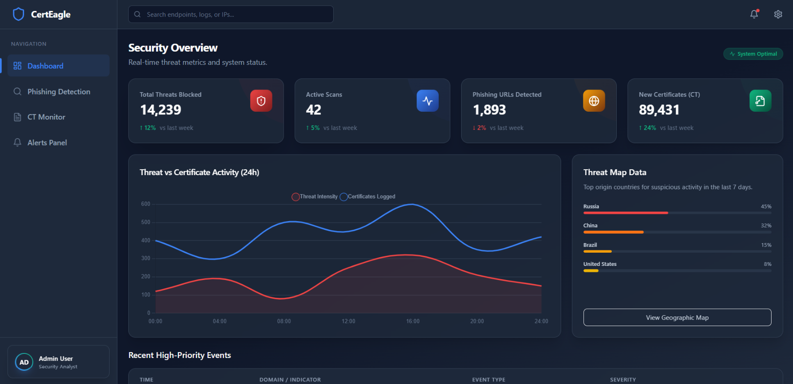

# 🛡️ CertEagle

### Cybersecurity Certificate & Phishing Monitoring Dashboard

CertEagle is a cybersecurity dashboard designed to provide a centralized interface for monitoring phishing threats, Certificate Transparency activity, security alerts, and threat analytics.

---

## 📸 Dashboard Preview



---

## ✨ Features

* 📊 **Security Overview Dashboard**
* 🔍 **Phishing Detection**
* 📜 **Certificate Transparency Monitoring**
* 🔔 **Security Alerts Panel**
* 📈 **Interactive Security Charts**
* 🌐 **Threat Monitoring**
* 📋 **Security Event Tables**
* 🔎 **Domain and Security Activity Monitoring**

---

## 🛠️ Technologies Used

| Technology          | Purpose                    |
| ------------------- | -------------------------- |
| ⚛️ React.js         | Frontend development       |
| ⚡ Vite              | Development and build tool |
| 🎨 Tailwind CSS     | User interface styling     |
| 🧭 React Router     | Application navigation     |
| 📊 Chart.js         | Data visualization         |
| 📈 React Chart.js 2 | React chart integration    |
| 🧩 Lucide React     | Interface icons            |
| 💻 JavaScript       | Application logic          |

---

## 📂 Project Structure

```text
CertEagle/
│
├── src/
│   ├── components/
│   ├── pages/
│   ├── App.jsx
│   └── main.jsx
│
├── index.html
├── package.json
├── package-lock.json
├── postcss.config.js
├── tailwind.config.js
├── vite.config.js
├── dashboard.png
├── .gitignore
└── README.md
```

---

## 🚀 Installation

### 1. Clone the repository

```bash
git clone https://github.com/Yuvatejayeturi/certeagle.git
```

### 2. Navigate to the project

```bash
cd certeagle
```

### 3. Install dependencies

```bash
npm install
```

### 4. Start the development server

```bash
npm run dev
```

The application will be available locally at:

```text
http://localhost:5173
```

---

## 🏗️ Production Build

To create a production build:

```bash
npm run build
```

To preview the production build locally:

```bash
npm run preview
```

---

## 📌 Project Status

**Status: Active Development**

CertEagle currently provides a frontend cybersecurity dashboard interface for phishing detection, Certificate Transparency monitoring, security alerts, and threat analytics.

> **Note:** The current dashboard interface uses frontend/demo data for visualization and presentation. It should not be interpreted as a live security monitoring service.

---

## 🎯 Project Goals

CertEagle is designed to provide a centralized interface that can help users:

* Monitor potential phishing activity
* View Certificate Transparency information
* Understand security events through visualizations
* Organize security alerts
* Explore domain and certificate-related activity

---

## 👨‍💻 Author

### Yeturi Yuva Teja

**B.Tech — Computer Science & Engineering (Cyber Security)**

* GitHub: https://github.com/Yuvatejayeturi
* Project: https://github.com/Yuvatejayeturi/certeagle

---

## ⭐ Support

If you find this project useful or interesting, consider giving the repository a ⭐ on GitHub.
